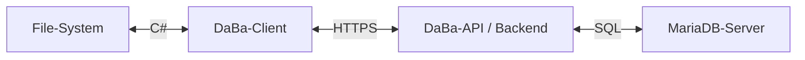

  

<h1 align="center">DaBa File Manager</h1>
<h3 align="center">file manager with multi-user support and end-to-end file-encryption</h3>

```mermaid
  flowchart LR
    id0[File-System] <--C#--> id1[DaBa-Client]
    id1 <--HTTPS--> id2[DaBa-API / Backend]
    id2 <--SQL--> id3[MariaDB-Server]
```
